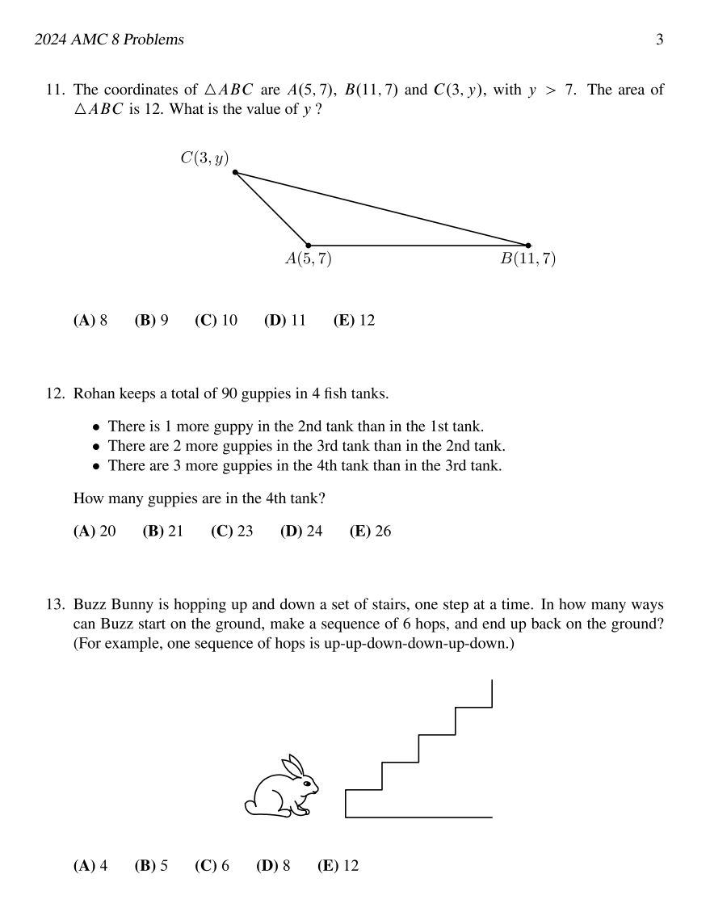
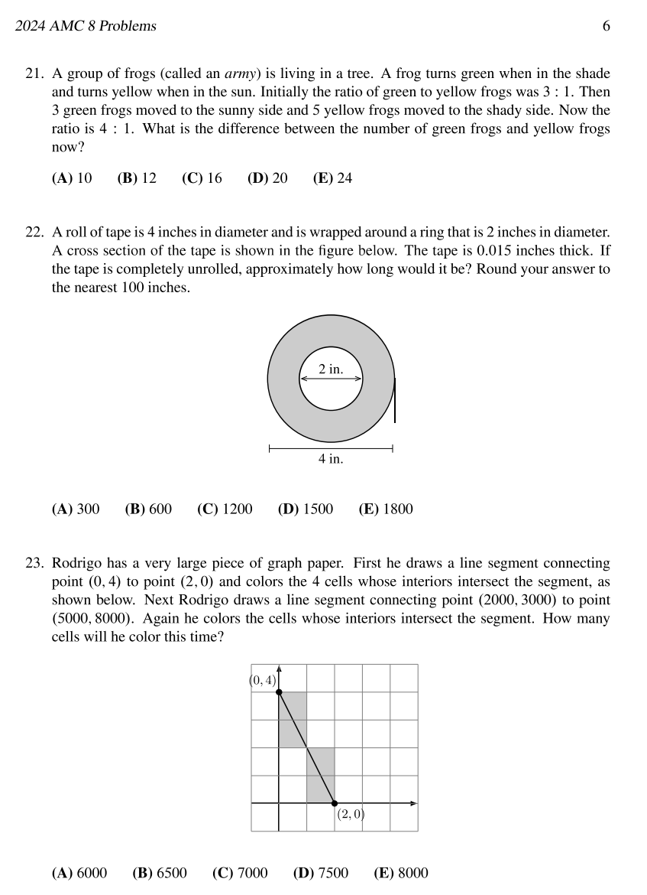

## Unveiling the Brilliance: A Recap of the 2024 AMC 8 Mathematics Competition

### Introduction
The world of competitive mathematics witnessed another thrilling chapter with the 2024 AMC 8 (American Mathematics Competitions for 8th-grade students). This annual event is not just a contest but a celebration of young mathematical minds showcasing their problem-solving skills, creativity, and passion for the subject. In this article, we will delve into the highlights and significance of the 2024 AMC 8 competition.

### The AMC 8 Overview
The AMC 8 is a prestigious math competition designed for middle school students, specifically those in 8th grade or below. Organized by the Mathematical Association of America (MAA), the competition aims to foster an appreciation for mathematics and encourage students to explore the exciting world of problem-solving. This year's event brought together thousands of young mathematicians from across the United States, each eager to prove their mathematical prowess.

### Challenging Problem Sets
One of the key aspects that make the AMC 8 stand out is its challenging problem sets. The questions are crafted to test not only the students' mathematical knowledge but also their ability to think critically and approach problems with creativity. From geometry to algebra, number theory to probability, the problem sets cover a wide range of mathematical concepts, ensuring that participants are well-rounded in their skills.

### Individual Brilliance
The 2024 AMC 8 showcased the individual brilliance of participants as they tackled complex problems with enthusiasm and determination. The competition is a platform for students to shine and demonstrate their problem-solving capabilities. It's not just about finding the right answer but understanding the underlying principles and applying them effectively.

### Community and Collaboration
While the AMC 8 is an individual competition, it also fosters a sense of community and collaboration among young mathematicians. Participants share their experiences, strategies, and excitement for mathematics, creating an environment that celebrates the joy of learning and discovery. This sense of camaraderie is invaluable in shaping the future of mathematics enthusiasts.

### The Role of Educators
Behind every successful participant in the AMC 8 are dedicated educators who nurture and guide their students. Teachers play a crucial role in preparing students for the competition, imparting not only mathematical knowledge but also instilling a love for the subject. The AMC 8 is a testament to the partnership between students and educators in the pursuit of excellence.

### Looking Ahead
As we reflect on the 2024 AMC 8, it's evident that the future of mathematics is in capable hands. The competition not only identifies young talents but also inspires others to embark on their mathematical journey. The skills developed through participating in the AMC 8 extend beyond the realm of mathematics, equipping students with problem-solving abilities that are valuable in various aspects of life.

### Conclusion
The 2024 AMC 8 was more than just a competition; it was a celebration of mathematical curiosity and talent. As we applaud the participants for their achievements, we also recognize the role of educators and the mathematical community in nurturing the next generation of problem solvers. The AMC 8 continues to be a beacon of inspiration, paving the way for future breakthroughs in the fascinating world of mathematics.

### PS
thats everything! if you're interested in other contests such as aime, contact us on discord 😉
[contact info](/post/contact)